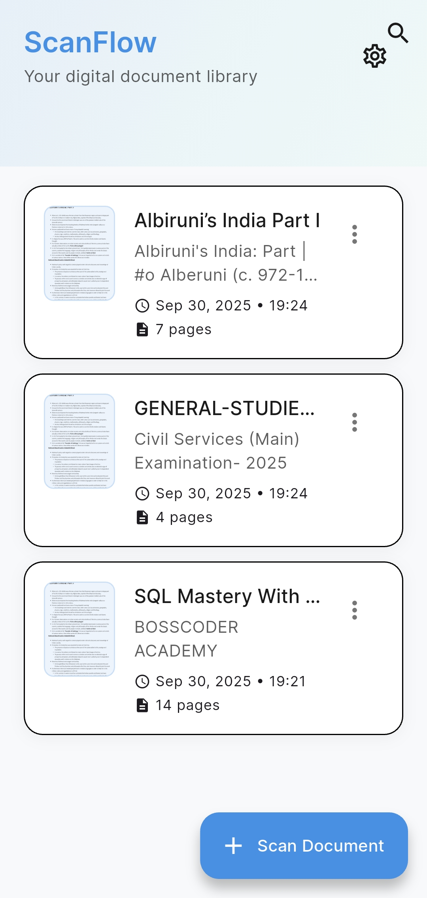
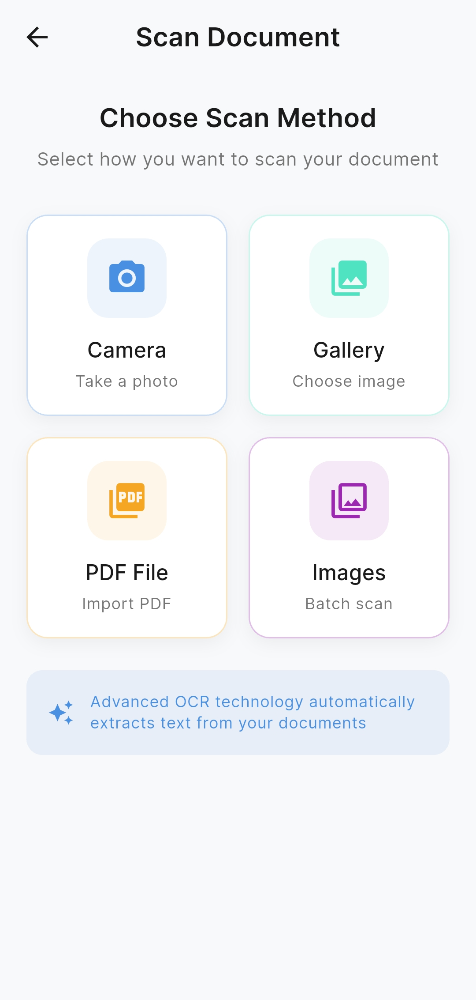
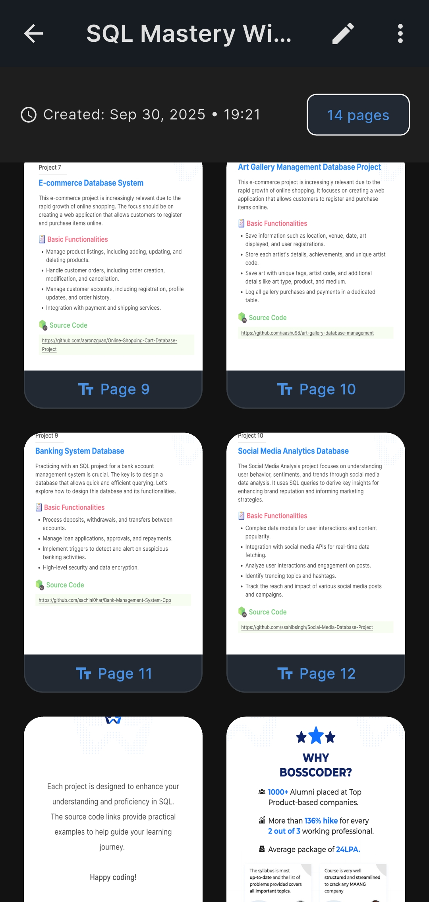
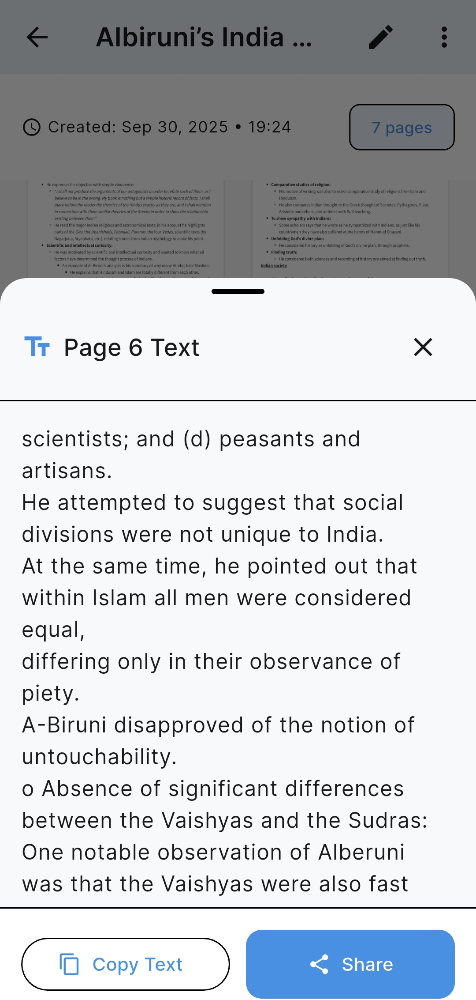
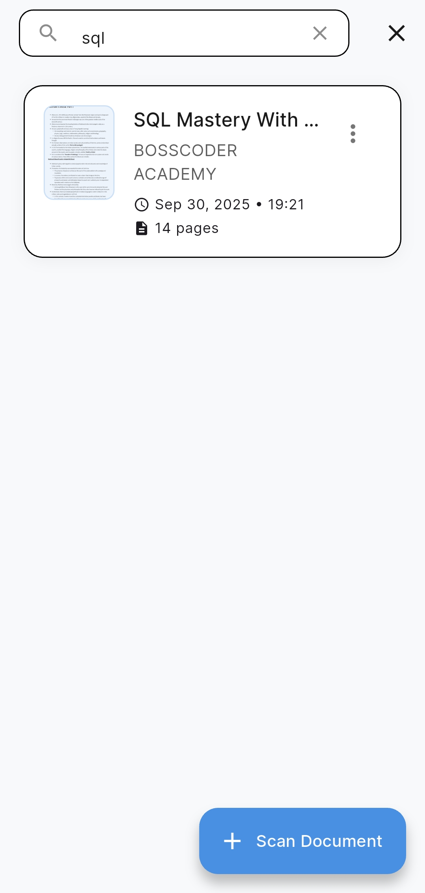
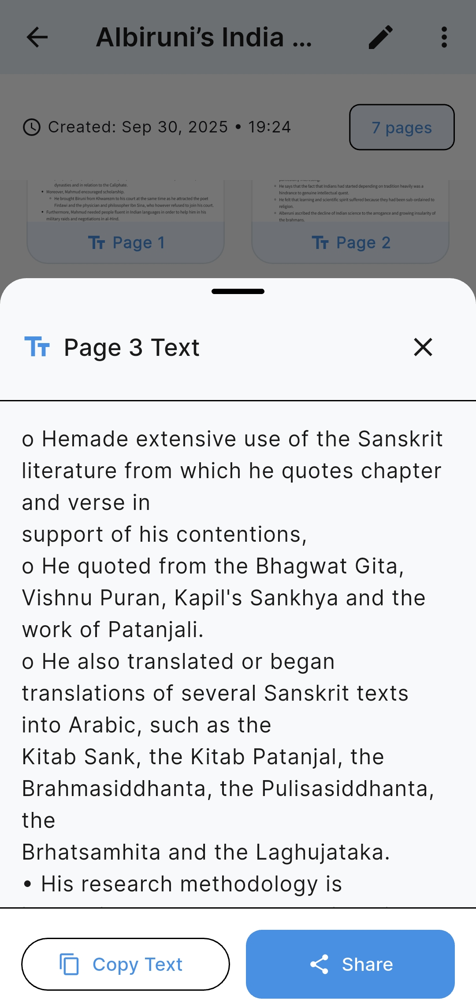
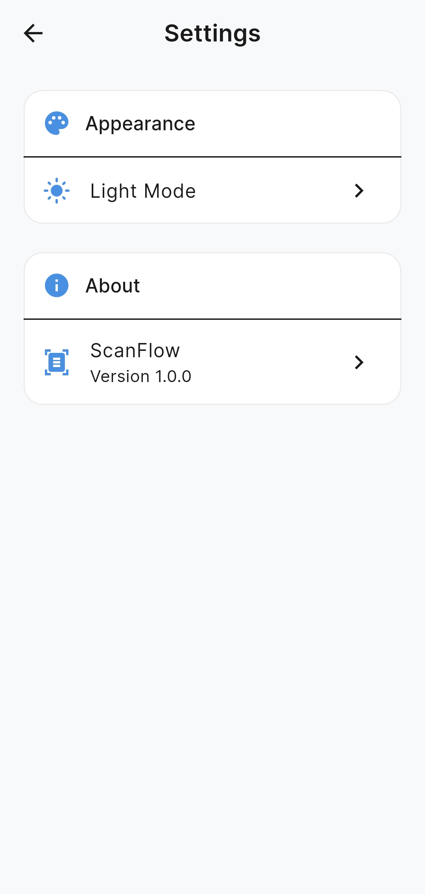
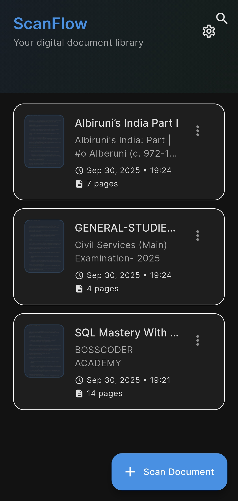

# ScanFlow - Beautiful OCR Scanner

**Transform your documents, digitize your world**

A modern, intuitive OCR (Optical Character Recognition) mobile application built with Flutter. ScanFlow transforms your device into a powerful document scanner with beautiful UI, smooth animations, and intelligent text recognition.


## Screenshots

| Home Screen | Camera Scanner | OCR Results | Document History |
|-------------|----------------|-------------|------------------|
|  |  |  |  |

| Text Editing | Export Options | Settings | Dark Mode |
|--------------|----------------|----------|-----------|
|  |  |  |  |

## Features

### Core Functionality
- **Live Camera Scanning**: Instant text recognition directly from camera feed
- **Multi-page Support**: Scan and combine multiple pages into single documents
- **Image & PDF Import**: Process images from gallery or import existing PDFs
- **Smart Text Recognition**: Powered by Google ML Kit for accurate OCR
- **Document History**: Organized storage of all scanned documents with search
- **Interactive Text Editing**: Edit extracted text directly in the app
- **Multiple Export Options**: Copy to clipboard, share as text, or export as PDF

### Beautiful Design
- **Modern UI**: Clean, minimalist design with Inter font family
- **Smooth Animations**: Fluid transitions and micro-interactions powered by Flutter Animate
- **Dark/Light Themes**: Automatic theme switching based on system preference
- **Intuitive Navigation**: Easy-to-use interface with clear visual hierarchy
- **Responsive Layout**: Adapts beautifully to different screen sizes

### Performance & UX
- **Fast Processing**: Optimized OCR pipeline for quick results
- **Local Storage**: Secure offline document storage with Isar database
- **Smart Search**: Find documents by title or content instantly
- **Progress Tracking**: Visual feedback during document processing
- **Privacy First**: All processing happens locally on your device

## How It Works

1. **Scan**: Point your camera at any document or import from gallery
2. **Process**: Advanced ML Kit OCR extracts text with high accuracy
3. **Edit**: Review and edit the extracted text as needed
4. **Save**: Store documents locally with automatic organization
5. **Share**: Export as text, PDF, or share directly with other apps

## Technology Stack & Dependencies

### Core Framework
- **Flutter SDK**: `>=3.0.0` - Cross-platform mobile development
- **Dart**: `>=3.0.0` - Modern programming language

### State Management
- **Riverpod**: `^2.4.9` - Reactive state management
- **Flutter Riverpod**: `^2.4.9` - Flutter integration for Riverpod

### OCR & Camera
- **Google ML Kit Text Recognition**: `^0.14.0` - Advanced OCR engine
- **Camera**: `^0.11.0+2` - Native camera access and control
- **Image Picker**: `^1.1.2` - Gallery and camera image selection

### File Handling & Storage
- **File Picker**: `^9.0.0` - Document and file selection
- **PDFx**: `^2.8.0` - PDF rendering and manipulation
- **Isar Community**: `3.3.0-dev.3` - High-performance NoSQL database
- **Path Provider**: `^2.1.5` - File system path access
- **Path**: `^1.9.1` - Cross-platform path manipulation

### UI & Animations
- **Flutter Animate**: `^4.5.2` - Beautiful animations and transitions
- **Google Fonts**: `^6.2.1` - Inter font family integration
- **Material 3**: Built-in modern design components

### Utilities & Services
- **Share Plus**: `^7.0.2` - Native sharing capabilities
- **Permission Handler**: `^11.3.1` - Runtime permission management
- **Intl**: `^0.19.0` - Internationalization support
- **Shared Preferences**: `^2.2.2` - Local key-value storage

### Development Tools
- **Flutter Lints**: `^2.0.0` - Code quality and style enforcement
- **Build Runner**: `^2.4.13` - Code generation utilities
- **Isar Generator**: `3.3.0-dev.3` - Database schema generation
- **Flutter Launcher Icons**: `^0.14.4` - App icon generation

## Quick Start

### Prerequisites
- Flutter SDK `>=3.0.0`
- Dart SDK `>=3.0.0`
- Android Studio / VS Code with Flutter extensions
- Physical device or emulator for testing

### Installation

1. **Clone the repository**
   ```bash
   git clone https://github.com/Rohit-Chandra-007/flutter_ocr_app.git
   cd scanflow
   ```

2. **Install dependencies**
   ```bash
   flutter pub get
   ```

3. **Generate required files**
   ```bash
   dart run build_runner build
   ```

4. **Run the app**
   ```bash
   flutter run
   ```

### Building for Production

```bash
# Android APK (for testing)
flutter build apk --release

# Android App Bundle (for Play Store)
flutter build appbundle --release

```

## Permissions Required

ScanFlow requires the following permissions to function properly:

- **Camera**: For live document scanning
- **Storage**: For saving and accessing documents
- **Photos**: For importing images from gallery

All permissions are requested at runtime with clear explanations.

## Architecture

ScanFlow follows a clean, scalable architecture with feature-based organization:

```
lib/
├── main.dart                           # App entry point with Riverpod
├── app/                               # App-level configuration
│   ├── app.dart                      # Main app widget
│   └── theme/                        # Design system
│       └── app_theme.dart           # Colors, typography, spacing
├── features/                         # Feature modules
│   ├── scan_history/                # Document history
│   │   ├── screens/                 # Home screen
│   │   ├── widgets/                 # History cards, search
│   │   └── providers/               # State management
│   ├── camera/                      # Camera scanning
│   │   └── screens/                 # Camera interface
│   └── ocr/                         # Text recognition
│       ├── services/                # OCR & PDF processing
│       └── widgets/                 # Result views
├── core/                            # Shared utilities
│   ├── models/                      # Data models
│   ├── services/                    # Database, samples
│   ├── constants/                   # App constants
│   └── utils/                       # Helper functions
└── shared/                          # Reusable components
    └── widgets/                     # Custom buttons, etc.
```

## Design System

### Color Palette
- **Primary Blue**: `#4A90E2` - Main brand color
- **Accent Teal**: `#50E3C2` - Secondary actions
- **Accent Orange**: `#F5A623` - Highlights and CTAs

### Typography
- **Font Family**: Inter (Google Fonts)
- **Type Scale**: Consistent sizing from display to caption
- **Weight Hierarchy**: 400 (regular) to 700 (bold)

### Spacing System
- **Base Unit**: 4px increments (4, 8, 12, 16, 20, 24, 32)
- **Consistent Margins**: Applied throughout the app
- **Responsive Layout**: Adapts to different screen sizes

## Contributing

We welcome contributions from the community! Here's how you can help:

### Ways to Contribute
- Report bugs and issues
- Suggest new features
- Improve documentation
- Submit pull requests
- Star the repository

### Development Setup
1. Fork the repository
2. Create a feature branch: `git checkout -b feature/amazing-feature`
3. Make your changes and test thoroughly
4. Commit your changes: `git commit -m 'Add amazing feature'`
5. Push to the branch: `git push origin feature/amazing-feature`
6. Submit a pull request

## Support & Feedback

- **Issues**: [GitHub Issues](https://github.com/Rohit-Chandra-007/flutter_ocr_app/issues)
- **Discussions**: [GitHub Discussions](hhttps://github.com/Rohit-Chandra-007/flutter_ocr_app/discussions)
- **Email**: scanflowstudio.dev@gmail.com

## License

This project is licensed under the MIT License - see the [LICENSE](LICENSE) file for details.

## Acknowledgments

- **Google ML Kit** team for excellent OCR capabilities
- **Flutter** team for the amazing cross-platform framework
- **Riverpod** community for reactive state management
- **Inter Font** by Rasmus Andersson for beautiful typography
- All contributors and beta testers who made this possible

---

**Made with ❤️ using Flutter**

**ScanFlow** - Transform your documents, digitize your world

[⭐ Star this repo](https://github.com/Rohit-Chandra-007/flutter_ocr_app) • [🐛 Report Bug](https://github.com/Rohit-Chandra-007/flutter_ocr_app/issues) • [💡 Request Feature](https://github.com/Rohit-Chandra-007/flutter_ocr_app/issues)